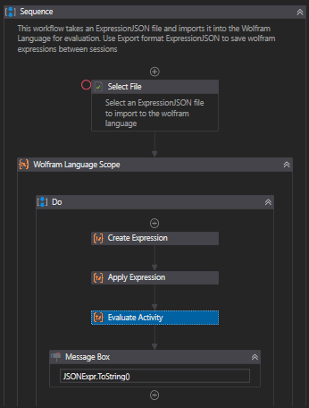

# Wolfram Language Integration

Connect to the scientific, symbolic scripting language, Wolfram Language. Allows evaluation of complex, arbitrary expressions directly from workflows

## Description

The Wolfram Language + UiPath package allows connection from UiPath workflows to the Wolfram Language system. Enables users to perform advanced mathematical analysis, create rich visualisations, and open up the possibilities for deep integration between a symbolic language with immense capabilities and a sophisticated automation framework.

## What it does

This custom activity pack allows a user to launch or connect to a Wolfram Language kernel and interact as if they were working directly in the Wolfram Language REPL. The user can evaluate Wolfram Language expressions as strings or the Expression class provided with the WL .NET Interface. The results of this expression map back to .NET Types for use in the workflow. Expressions can also be evaluated to images, sound, or even custom .NET Objects.

There are also low level commands that allow interaction with the Wolfram Language on a packet level. The Wolfram Language / .NET interface uses Wolfram Symbolic Transfer Protocol to facilitate communication between the symbolic runtime of the WL kernel and the object-oriented .NET runtime. Direct manipulation of this protocol allows for complete and direct control of the Wolfram Language kernel.

The user may open a Wolfram Language kernel as a parent scope with evaluations inside, and the activity pack will take care of the setup and tear-down of the WL runtime process, or the user may open a Kernel and store it as a variable in their workflow for use later, closing it manually when required.

## Use Cases

The Wolfram Language has a tremendous range of domains it can interact with, including machine learning, image processing, natural language processing, scientific data processing, and much more. Examples that are provided with the project include: retrieving stock data and creating charts of historical prices, generating decay graphs of radioactive isotopes, performing queries to the online service Wolfram Alpha, and searching for the textual answer to a user's question in a knowledgebase article. The full documentation for the Wolfram Language is available online [here](https://reference.wolfram.com/language/)

## Setup

First, ensure you have the Wolfram Language system installed on your machine. This could either be from an existing Mathematica installation or by installing the [Free Wolfram Engine for Developers](https://www.wolfram.com/engine/), a non-production license to allow development on the Wolfram Language with a limited feature set.

The Wolfram .NET Link DLL must be provided to UiPath Studio in order to import this package. [Use the MoveWolframDLL UiPath project that is provided with the GitHub Repository](https://github.com/JosephIaquinto/TroyWeb.WolframLanguage.Activities/tree/master/MoveWolframDLL) in order to copy the Wolfram.NETLink.dll file from your Wolfram Engine installation folder into your UiPath Studio Local App Data folders. This step is required because the Wolfram.NETLink.DLL assembly is not strongly named and it cannot be discovered in the .NET Global Assembly Cache, and Wolfram's license restricts redistribution of the DLL. To accomplish this manually, copy the Wolfram.NETLink.DLL from your Wolfram Installation Path \ Version \ SystemFiles \ Links \ NETLink to each App folder in %LOCALAPPDATA% \ UiPath. This must be done before the package will be able to be imported into your project.

Next, add the TroyWeb.WolframLanguage.Activities package to your project. Drag a Wolfram Language Scope activity into your sequence. The activity will attempt to locate the MathKernel.exe file in your Wolfram Language or Mathematica installation directory. If it is not found, provide this path to the parent scope activity to allow evaluations to be made. [Examples are also available on the project Github](https://github.com/JosephIaquinto/TroyWeb.WolframLanguage.Activities/tree/master/Examples)

*You will not be able to install this package without first installing a Wolfram product which includes MathLink and .NETLink. You will need to move the Wolfram.NETLink DLL to you UIPath LocalAppData environment folder. This can be done manually or use the MoveWolframDLL UiPath process included on the Github Repository.*

## Examples

The WolframImportJSON example shows how to create and apply expressions, as well as input expressions to the Wolfram system in a more conveinient format.

First, the user selects a file that is a Wolfram Language expression exported as ExpressionJSON. Then a Wolfram Language scope is opened and a symbol Expr is created to express the Import function. That Expr is then applied to an array with the selected file path and the format of the input, "ExpressionJSON". The resulting Expr object is then sent to the Wolfram Kernel in the scope to be evaluated and the evaluation result is displayed in a message box.

## Activities

* Wolfram Language Scope
  * This is the parent activity that allows Evaluate and Packet Management activities to be used to communicate with an opened Kernel. Automatically handles starting and stopping the Wolfram kernel if one is not provided.
  * Inputs:
    * For an already open Kernel:
      * Kernel: Input/Output
        * Required: an existing IKernelLink object representing an open connection to the Wolfram Kernel. If null, a new Kernel will be opened and assigned to this argument after the scope closes for use in later scopes.
    * For a new Kernel:
      * Kernel Path
        * Optional: Activity will attempt to locate the MathKernel.exe path automatically if this path is not provided. MathKernel.exe can typically be found in Program Files\Wolfram Research\Wolfram Engine\12.0 or your Mathematica installation directory
      * Kernel Arguments
        * MathLink specifications for establishing a link, fully documented in MathLink Docs. Defaults to {"-linkmode", "launch", "-linkname", KernelPath}
      * Close Kernel after Completion
        * Optional: default True: boolean value to determine if the activity should close the kernel connection when the scope closes.
      * Enable .NET Object References
        * Optional, default false. Boolean to determine if the Wolfram Language should be configured to allow communication of arbitrary .NET Types and methods to and from the kernel.
    * Sleep Duration
      * Optional: default 100ms. Integer value to determine how many milliseconds the thread should sleep while waiting for the Wolfram Kernel process to start and connect to the .MET runtime.
* Kernel category
  * Open Kernel
    * Opens a connection to the Wolfram Kernel and returns a kernel object that may be used in multiple Wolfram Language Scopes
    * Inputs are the same as the New Kernel version of Wolfram Language Scope
    * Output: An IKernelLink object representing the connection to a wolfram language kernel
  * Close Kernel
    * Closes an open kernel to free resources.
    * Inputs: An IKernelLink object representing the connection to a wolfram language kernel
* Expression category
  * Create Expression
    * Creates an Expr object of the provided Expression Type and name
    * Inputs:
      * Expression Type: An ExpressionType enum value of the type of expression to be created. Examples: Symbol, Function, Integer, String, Object, and Complex
      * Name: The value of the expression as a string. Example: "NSolve", "+", "7", "Hello World!", "x"
    * Output: Wolfram Expr object. Compose Expr objects with Apply Expression activity to apply a function Expr to an array of Integer Expr arguments.
  * Apply Expression
    * Applies a provided Expr object to act on an array of arbitrary arguments and returns the resulting Expr object
    * Inputs:
      * Head: Object. Expr that will be applied to the arguments.
      * Arguments: Object[]. Expressions that will have the head applied.
    * Output: Expr representing the application of Head to the Arguments.
* Evaluate category
  * Evaluate
    * Evaluates a wolfram language expression provided as a string or Expr object as an Expr object
    * Input:
      * Expression: String or Expr. The Wolfram Language expression to evaluate. Must choose either Expr or String input.
      * Timeout: number of seconds as an int, optional (default 5 minutes). Cancel evaluation if a result is not evaluated in timeout seconds.
    * Output:
      * Result: Expr. The result of the evaluation.
  * Evaluate to image
    * Evaluates a wolfram language expression provided as a string or Expr object as an .NET Image object of provided height and width
    * Input:
      * Expression: String or Expr. The Wolfram Language expression to evaluate. Must choose either Expr or String input.
      * Image Height: Int. The output image's pixel height.
      * Image Width: Int. The output image's pixel width.
      * Timeout: number of seconds as an int, optional (default 5 minutes). Cancel evaluation if a result is not evaluated in timeout seconds.
    * Output:
      * Result: Image. The exported .NET Image object
  * Evaluate to input form
    * Evaluates a wolfram language expression provided as a string or Expr object as it would be entered as an ASCII string
    * Input:
      * Expression: String or Expr. The Wolfram Language expression to evaluate. Must choose either Expr or String input.
      * Timeout: number of seconds as an int, optional (default 5 minutes). Cancel evaluation if a result is not evaluated in timeout seconds.
    * Output:
      * Result: String. The result of the evaluation formatter as it would be entered in the wolfram console.
  * Evaluate to output form
    * Evaluates a wolfram language expression provided as a string or Expr object as it would output as an ASCII string
    * Input:
      * Expression: String or Expr. The Wolfram Language expression to evaluate. Must choose either Expr or String input.
      * Timeout: number of seconds as an int, optional (default 5 minutes). Cancel evaluation if a result is not evaluated in timeout seconds.
    * Output:
      * Result: String. The result of the evaluation formatter as it would appear in the wolfram console.
* Low Level category
  * Packet Management category
    * New Packet
      * Communicate to the kernel that a new packet is starting on the communication buffer
    * End Packet
      * Communicate to the kernel that the current packet on the communication buffer is closed
    * Flush Buffer
      * Push all buffered WSTP packets to the Wolfram Kernel
    * Wait for the next packet
      * Syncronously wait for a response packet to be received from the Wolfram Kernel
  * Get Data category
    * Get Expression
      * Get the expression at the front of the results queue
      * Output: Expr. Expression object representation of the next result.
    * Get Value
      * Get the value at the front of the results queue
      * Output: Result as user selected .NET Type
    * Peek Expression
      * Get the expression at the front of the results queue, but do not remove it
      * Output: Expr. Expression object representation of the next result.
  * Put Data category
    * Put Argument Count
      * Add the count of arguments for the current function in the packet
      * Input: Int. Number of arguments.
    * Put Data
      * Add arbitrary data to the current packet
      * Input:
        * Data: Byte[] Arbitrary byte array data stream to send to Wolfram.
        * Size: Int. Length of Data input.
    * Put Function
      * Add a function call to the current packet
      * Input:
        * Name: String. The function name to be added to the packet waiting to be written to the Kernel.
        * Argument Count: Int. The number of arguments you will be adding to the packet for this function.
    * Put Next Expression Type
      * Indicate the type of the next expression that will be added to the packet
      * Input:
        * Expression Type: The Wolfram.NETLink ExpressionType enum of the next object placed on the packet.
    * Put Reference
      * Insert a reference to a .NET object in order to send to the kernel. Mush have "Enable Object References" wolfram language scope parameter enabled.
      * Input:
        * Object: Object by reference to be put into to the packet in the buffer.
        * Type: .NET Type of the provided object.
    * Put Symbol
      * Add a symbol to the current packet
      * Input:
        * Name: String. Symbol to be added to the packet.
    * Put Value
      * Add a value to the current packet
      * Input:
        * Value: Dynamic type. Input any value that can be converted to an ExpressionType or Expr.

## Future Development

There are many processes you can use the Wolfram Language, but some basic workflows that many users would want are tedious to create in UiPath studio. I want to build a package of snippets / workflows to simplify standard processes such as changing the Wolfram Language's current directory, or exporting an evaluated object to the Wolfram Cloud. I would also like to connect the WL Kernel to a front-end so that the visualisations may be interacted with and used with standard UiPath activities.

## Benefits

Enables users to perform advanced mathematical analysis, create rich visualizations, and open up the possibilities for deep integration between a symbolic language with immense capabilities and a sophisticated automation framework. Provides full integration to Wolfram to extend UiPath capabilities into many different fields.

## Dependencies

The Wolfram Engine, available with Mathematica or the Free Wolfram Engine for Developers.
UiPath
Newtonsoft.JSON 10.0.3+

## Compatibility

All UiPath versions (Tested on 2019.4+)
All Wolfram Language Versions from V4 and up.

NOTICE: I do not own the Wolfram Engine or any part therof. This was developed using the Free Wolfram Engine™ for Developers. You may not use this in production or for commercial use without purchasing a production wolfram engine license from the Wolfram Foundation.

## Issue Reporting & Contributing

This project uses Github to track open issues and facilitate contributions from the community. If any issues occur please file an issue on the Github Repository. Pull requests are also certainly welcome. 
